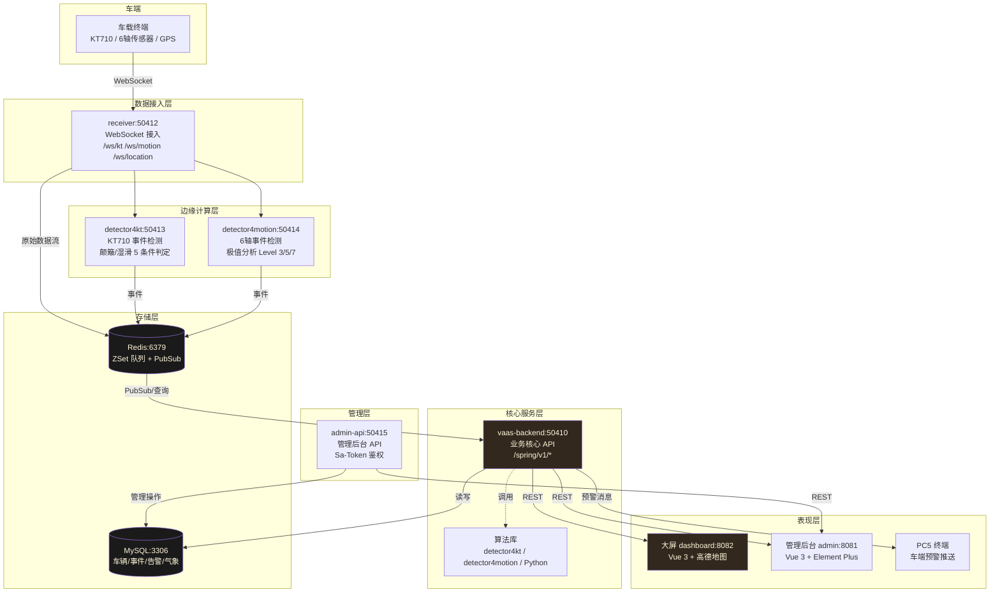
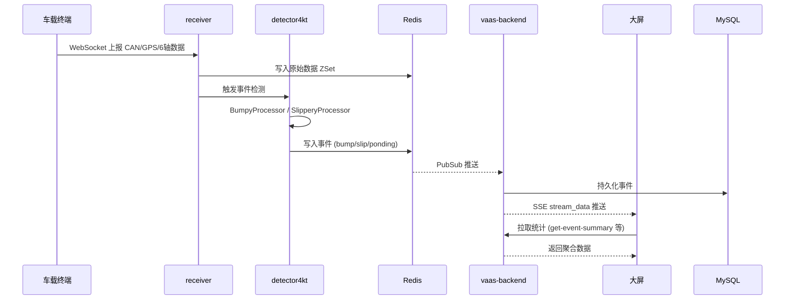

# VaaS 项目复现

城市级道路状态感知与预警系统（Vehicle as a Sensor, VaaS）复现项目。

## 系统架构



### 数据流时序



## 技术栈

| 模块 | 技术 |
|------|------|
| 大屏 | Vue 3 + Vite + Element Plus + ECharts + 高德地图 |
| 管理后台 | Vue 3 + Vite + Element Plus |
| 后端 | 5 × Spring Boot 3.5.3 (JDK 17) |
| 算法 | Java (反编译还原) + Python (六轴颠簸) |
| 数据 | MySQL 9.6 + Redis 8.8 |

## 快速开始

```bash
# 1. 初始化数据库
bash scripts/init-db.sh

# 2. 一键启动所有服务
bash scripts/start.sh

# 3. 访问大屏
open http://localhost:8082
```

## 服务端口

| 服务 | 端口 | 说明 |
|------|------|------|
| receiver | 50412 | WebSocket 数据接入 |
| vaas-backend | 50410 | 核心业务 API |
| detector4kt | 50413 | KT710 事件检测 |
| detector4motion | 50414 | 6轴运动检测 |
| admin-api | 50415 | 管理后台 API |
| 大屏前端 | 8082 | Vue 3 开发服务器 |
| 管理后台 | 8081 | Vite 开发服务器 |

## 脚本工具

所有脚本在 `scripts/` 目录下：

| 脚本 | 用法 | 说明 |
|------|------|------|
| `start.sh` | `bash scripts/start.sh` | 一键启动（MySQL + Redis + 5个微服务 + 前端）。JDK 自动检测（环境变量→系统 java→macOS java_home→Linux 路径） |
| `stop.sh` | `bash scripts/stop.sh` | 一键停止所有服务（优雅 stop + 兜底 kill -9） |
| `restart.sh` | `bash scripts/restart.sh [服务名] [-f] [--no-start]` | 一键重启。`-f` 强制 kill；`--no-start` 只停不启 |
| `status.sh` | `bash scripts/status.sh [服务名]` | 检查所有服务运行状态（PID + 端口 + HTTP 健康检查） |
| `logs.sh` | `bash scripts/logs.sh [服务名] [-f] [-n N]` | 日志查看/跟踪。`-f` 实时跟踪；`-n N` 显示最近 N 行 |
| `init-db.sh` | `bash scripts/init-db.sh` | 数据库初始化（执行 `init-db.sql`） |
| `inject-data.sh` | `bash scripts/inject-data.sh` | 模拟数据注入（Redis / WebSocket 双模式） |

### 常用示例

```bash
# 启动后看哪些服务在跑
bash scripts/status.sh

# 实时跟踪大屏后端日志
bash scripts/logs.sh vaas-backend -f

# 改完 vaas-backend 代码后快速重启
bash scripts/restart.sh vaas-backend

# 强制重启前端（webpack 配置改了）
bash scripts/restart.sh dashboard -f
```

## 项目状态

详见 [TASK_TRACKING.md](./TASK_TRACKING.md)
